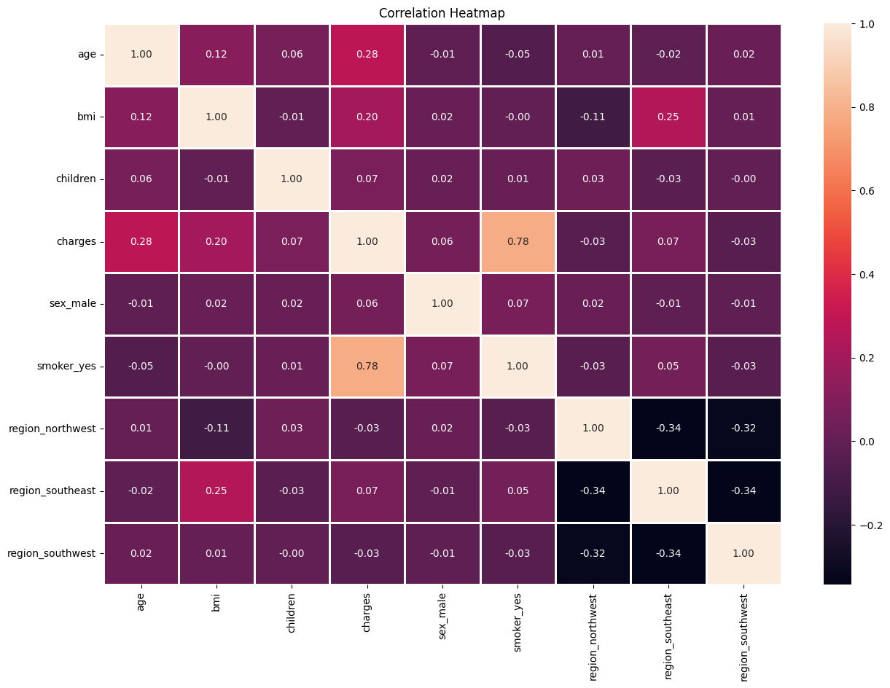
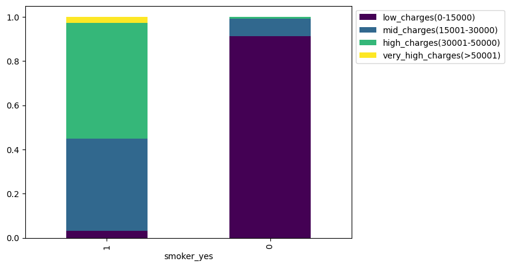
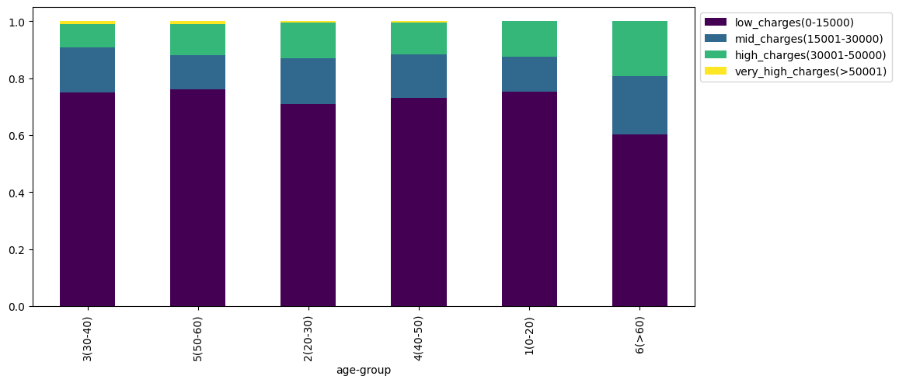
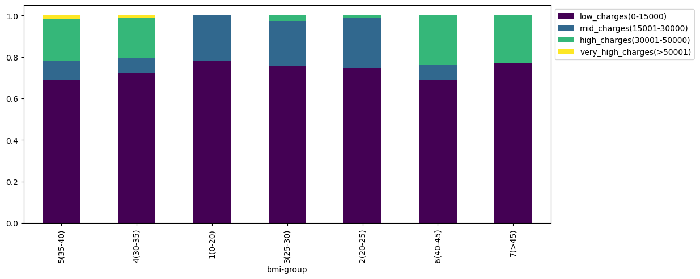
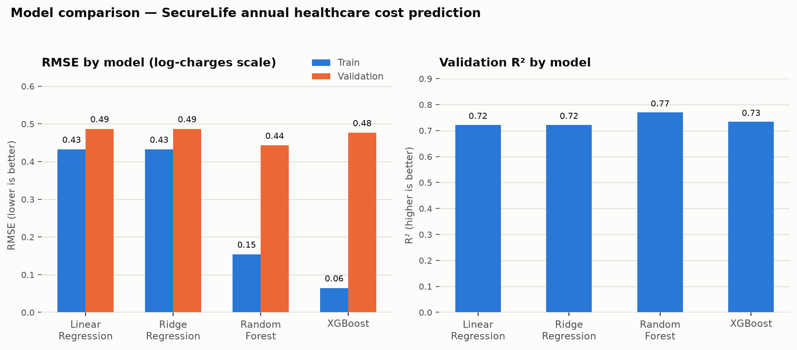

# SecureLife — Predicting Annual Healthcare Costs

A machine learning project built for **SecureLife Insurance Brokers**, a digital-first insurance brokerage, to predict an individual customer's annual medical expenses from their demographic and lifestyle data. The goal is to move the business off one-size-fits-all actuarial tables and onto data-driven, personalized coverage recommendations.

## Business problem

SecureLife currently prices coverage using traditional actuarial tables and basic demographics. This one-size-fits-all approach causes:

- **Under-insurance** — 35% of customers face financial hardship when actual medical costs exceed their coverage
- **Over-insurance** — 28% of customers pay for excessive coverage they don't need, hurting satisfaction and retention
- **Competitive disadvantage** — rivals with data-driven pricing offer sharper, more personalized quotes

A model that accurately estimates individual healthcare costs lets SecureLife recommend the right coverage amount per customer, reduce claim-to-premium ratios, and compete on precision rather than guesswork.

## Objective

Predict a customer's **annual medical charges (USD)** from:

| Feature | Description |
|---|---|
| `age` | Age of the applicant |
| `sex` | Gender |
| `bmi` | Body mass index |
| `children` | Number of dependents |
| `smoker` | Smoking status (yes/no) |
| `region` | Geographic region |

Models are evaluated with **RMSE** (lower is better) on log-transformed charges, alongside MAE, R², adjusted R², and MAPE.

## Repository contents

| File | Description |
|---|---|
| [`SecureLife_Analysis.ipynb`](./SecureLife_Analysis.ipynb) | End-to-end notebook: EDA, feature engineering, model training/tuning, and evaluation |

## Approach

1. **Data cleaning** — dropped the unique `customer_id` column, checked for nulls/duplicates (none found)
2. **Exploratory Data Analysis** — univariate distributions, a correlation heatmap, and pairwise plots; engineered `age-group` and `bmi-group` bins and a `charges-type` bucket to visualize how charges break down by segment
3. **Modeling** — trained and compared four regressors on log-transformed charges:
   - Linear Regression (baseline)
   - Ridge Regression, tuned via Grid Search, Randomized Search, and Bayesian Optimization (`BayesSearchCV`)
   - Random Forest Regressor
   - XGBoost Regressor
4. **Evaluation** — compared train vs. validation performance across all four models to pick the best generalizing model and flag overfitting

## Key findings

- **Smoking status is by far the strongest driver of cost.** The correlation heatmap shows `smoker_yes` correlated with `charges` at **0.78**, dwarfing every other feature.
- Smokers are heavily concentrated in the **high** and **very-high** charge bands, while non-smokers are overwhelmingly in the **low** charge band — a near-complete separation.
- `age` (0.28) and `bmi` (0.20) are secondary but meaningful cost drivers; region and sex show negligible correlation with charges.
- **Random Forest generalized best**, reaching the lowest validation RMSE while Linear/Ridge Regression underfit slightly and XGBoost overfit the training set (train RMSE 0.06 vs. validation 0.48).

### Correlation heatmap

### Charges by smoking status

Smokers are pushed almost entirely into the high-cost bands — the single clearest signal in the dataset.

### Charges by age group

### Charges by BMI group

### Model comparison

| Model | Train RMSE | Val RMSE | Val R² | Val MAPE |
|---|---|---|---|---|
| Linear Regression | 0.432 | 0.487 | 0.722 | 3.17% |
| Ridge Regression (tuned) | 0.432 | 0.487 | 0.722 | 3.17% |
| **Random Forest** | 0.154 | **0.443** | **0.770** | **2.33%** |
| XGBoost | 0.064 | 0.476 | 0.734 | 2.66% |

Random Forest offers the best validation RMSE and R² of the four models while keeping the train/validation gap reasonable, making it the recommended model for estimating coverage amounts.

## Tech stack

`Python` · `pandas` / `numpy` · `scikit-learn` · `XGBoost` · `scikit-optimize` (Bayesian search) · `seaborn` / `matplotlib`

## Getting started

Open [`SecureLife_Analysis.ipynb`](./SecureLife_Analysis.ipynb) in Jupyter or Google Colab. The notebook expects `Train_data__Insurance.csv` and `Test_data__Insurance.csv` (not included in this repo) with the schema described above.
